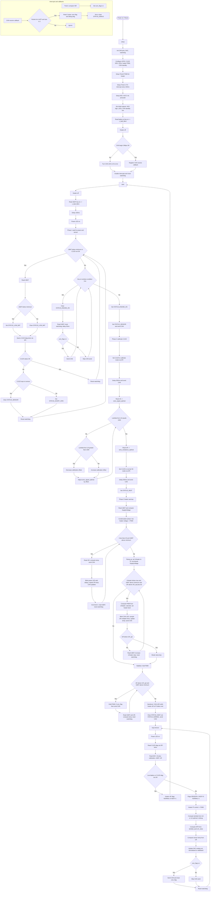

```mermaid
%% ============================
%% OpenAFR / CJ125 controller
%% ============================
flowchart TD

%% ---------- Setup ----------
A([Power on / Reset]) --> B[setup]
B --> B1[Init CAN pins, DAC, watchdog]
B1 --> B2[Configure GPIO: CJ125 NSS, LEDs, heater PWM, CAN standby]
B2 --> B3[Setup Timer0 PWM for heater]
B3 --> B4[Setup Timer1 CTC interrupt every 100ms]
B4 --> B5[Setup ADC: AVCC ref, prescaler]
B5 --> B6[Set initial outputs: NSS high, LEDs, CAN standby low]
B6 --> B7[Read battery at key-on -> v_batt_Mem]
B7 --> B8[Heater off]
B8 --> B9{CAN begin 1Mbps OK}
B9 -- No --> B10[Turn CAN LED on for error]
B9 -- Yes --> B11[Register CAN receive callback]
B10 --> B12[Enable interrupts and reset watchdog]
B11 --> B12
B12 --> C[start]

%% ---------- Start orchestrator ----------
C --> C0[Heater off]
C0 --> C1[Read UBAT key-on -> v_batt_Mem]
C1 --> C2[Delay 100ms]
C2 --> C3[Power LED on]

%% ---------- Phase 1: Wait for power and sensor ----------
C3 --> P1A[Phase 1 wait for power and sensor]
P1A --> P1B{UBAT below minimum or CJ125 not OK}
P1B -- Yes --> P1C[Read UBAT]
P1C --> P1D{UBAT below minimum}
P1D -- Yes --> P1D1[Set STATUS_LOW_BAT]
P1D -- No --> P1D2[Clear STATUS_LOW_BAT]
P1D1 --> P1E[Query CJ125 diag twice via SPI]
P1D2 --> P1E
P1E --> P1F{CJ125 status OK}
P1F -- No --> P1G{CJ125 says no sensor}
P1G -- Yes --> P1G1[Clear STATUS_SENSOR]
P1G -- No --> P1G2[Set STATUS_SHORT_CIRC]
P1G1 --> P1H[Reset watchdog]
P1G2 --> P1H
P1H --> P1B
P1F -- Yes --> P1I[Reset watchdog]
P1I --> P1B

%% engine-on window in phase 1
P1B -- No --> P1J{Key-on window condition true}
P1J -- Yes --> P1K[Clear STATUS_ENGINE_ON]
P1K --> P1L[Read UBAT; reset watchdog; delay 50ms]
P1L --> P1M{com_flag is 1}
P1M -- Yes --> P1N[Send CAN]
P1M -- No --> P1O[Skip CAN send]
P1N --> P1J
P1O --> P1J
P1J -- No --> P1P[Set STATUS_ENGINE_ON]
P1P --> C4[Set STATUS_SENSOR and send CAN]

%% ---------- Phase 2: Calibration ----------
C4 --> P2A[Phase 2 calibrate CJ125]
P2A --> P2B[Set CJ125 to calibrate mode via SPI]
P2B --> P2C[Delay 500ms and send CAN]
P2C --> P2D[Read UA -> sens_signal_optimal]
P2D --> P2E{Lambda from UA equals 1000}
P2E -- No --> P2F{Lambda from UA greater than 1000}
P2F -- Yes --> P2G[Decrease calibration offset]
P2F -- No --> P2H[Increase calibration offset]
P2G --> P2I[Adjust sens_signal_optimal by offset]
P2H --> P2I
P2I --> P2E
P2E -- Yes --> P2J[Read UR -> sens_resistance_optimal]
P2J --> P2K[Set CJ125 to normal V8 mode via SPI]
P2K --> P2L[Delay 500ms and send CAN]

%% ---------- Phase 3: Heater warmup ----------
P2L --> C5[Set STATUS_HEAT]
C5 --> P3A[Phase 3 heater warmup]
P3A --> P3B[Read UBAT and compute SupplyVoltage]
P3B --> P3C[Condensation phase: low heater voltage -> PWM]
P3C --> P3D{t less than 40 and UBAT above minimum}
P3D -- Yes --> P3E[Read UR; compute temp; send CAN]
P3E --> P3F[Blink power LED with delays; repeat UR temp CAN updates]
P3F --> P3G[Increment t; read UBAT; reset watchdog]
P3G --> P3D

P3D -- No --> P3H[Ramp-up: set UHeater to 75; recompute SupplyVoltage]
P3H --> P3I{UHeater below max and UBAT above minimum and UR above UR_opt plus 50}
P3I -- Yes --> P3J[Compute PWM from UHeater; saturate; set heater level]
P3J --> P3K[Blink CAN LED; sample UR multiple times; update temp; send CAN]
P3K --> P3L{UR below UR_opt}
P3L -- Yes --> P3M[Break ramp loop]
P3L -- No --> P3N[Read UBAT; increase UHeater step; reset watchdog]
P3N --> P3I

P3I -- No --> P3O[Stabilize: hold PWM]
P3M --> P3O
P3O --> P3P{UR above UR_opt and UBAT above minimum}
P3P -- Yes --> P3Q[Hold PWM; if com_flag then send CAN]
P3Q --> P3R[Read UBAT and UR; compute temp; reset watchdog]
P3R --> P3P
P3P -- No --> P3S[Handover: CAN LED solid; heater off so PI takes over]

%% finish start
P3S --> C6[Clear STATUS_HEAT; set STATUS_NORMAL; send CAN]
C6 --> D[loop forever]

%% ---------- Main loop ----------
D --> D1[Power LED on]
D1 --> D2[Read CJ125 diag via SPI twice]
D2 --> D3[Read ADC: UA plus calibration, UBAT, UR]
D3 --> D4{Low battery or CJ125 diag not OK}
D4 -- Yes --> D5[Heater off; flags NORMAL=0 HEAT=1]
D5 --> C

D4 -- No --> D6[Flags SENSOR=1 HEAT=0 NORMAL=1]
D6 --> D7[Heater PI control -> PWM]
D7 --> D8[Compute lambda from UA or UA optimal in debug]
D8 --> D9[Compute AFR from lambda; pack afr_value]
D9 --> D10[Compute sensor temp from UR]
D10 --> D11[Update DAC analog out: narrowband or wideband]
D11 --> D12{com_flag is 1}
D12 -- Yes --> D13[Send CAN and clear com_flag]
D12 -- No --> D14[Skip CAN send]
D13 --> D15[Reset watchdog]
D14 --> D15
D15 --> D

%% ---------- Interrupts and callbacks ----------
subgraph IRQs[Interrupts and callbacks]
  I1[Timer1 compare ISR] --> I2[Set com_flag to 1]
  CBR[CAN receive callback] --> CBR1{Packet id is 0xFF and size is 2}
  CBR1 -- Yes --> CBR2[Read 2 bytes: emu flag and debug flag]
  CBR2 --> CBR3[Set or clear STATUS_DEBUG]
  CBR1 -- No --> CBR4[Ignore]
end
```
