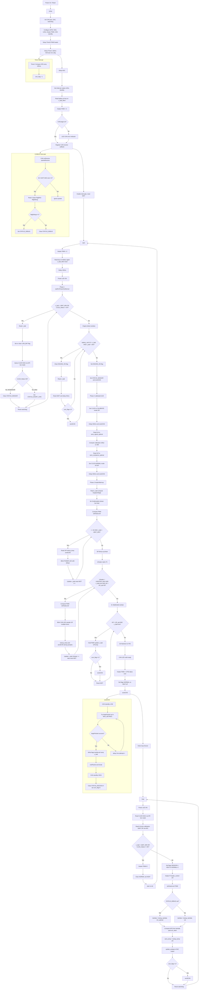

```mermaid
flowchart TD
  A[Power On / Reset] --> B[setup]
  B --> B1[Init CAN pins, DAC, watchdog]
  B1 --> B2[Configure GPIO: NSS, LEDs, Heater PWM, CAN standby]
  B2 --> B3[Setup Timer0 PWM heater]
  B3 --> B4[Setup Timer1 100ms interrupt com_flag] --> TIMERINT
  B4 --> B5[Setup ADC]
  B5 --> B6[Set initial pin states LEDs, standby]
  B6 --> B7[Read battery at key-on v_batt_Mem]
  B7 --> B8[Heater PWM = 0]
  B8 --> B9{CAN.begin ok?}
  B9 -- No --> B9a[LED CAN error indicator]
  B9 -- Yes --> B10[Register CAN receive callback] --> CANINT
  B9a --> B10
  B10 --> B11[Enable interrupts, reset WDT]
  B11 --> C[start]

  %% ---- STARTUP ORCHESTRATOR ----
  C --> C0[Heater PWM = 0]
  C0 --> C1[Read key-on battery again v_batt_Mem local]
  C1 --> C2[Delay 100ms]
  C2 --> C3[Power LED ON]
  C3 --> D[Phase 1 waitForPowerAndSensor]
  D --> D1{v_batt < UBAT_MIN OR CJ125_Status != OK?}
  D1 -- Yes --> D2[Read v_batt]
  D2 --> D3[Set or clear LOW_BAT flag]
  D3 --> D4[Query CJ125 DIAG via SPI two reads]
  D4 --> D5{CJ125_Status OK?}
  D5 -- No, NOSENSOR --> D6[Clear STATUS_SENSOR]
  D5 -- No, other --> D7[Set STATUS_SHORT_CIRC]
  D6 --> D8[Reset watchdog]
  D7 --> D8
  D8 --> D1
  D1 -- No --> D9[Engine detect window]
  D9 --> D10{battery_volt+10 > v_batt AND v_batt < 250?}
  D10 -- Yes --> D11[Clear ENGINE_ON flag]
  D11 --> D12[Read v_batt]
  D12 --> D13[Reset WDT and delay 50ms]
  D13 --> D14{com_flag==1?}
  D14 -- Yes --> D15[sendCAN]
  D14 -- No --> D10
  D15 --> D10
  D10 -- No --> D16[Set ENGINE_ON flag]
  D16 --> E[Set STATUS_SENSOR and sendCAN]

  E --> F[Phase 2 calibrateCJ125]
  F --> F1[Set CJ125 to CALIBRATE mode SPI]
  F1 --> F2[Delay 500ms and sendCAN]
  F2 --> F3[Read UA to sens_signal_optimal]
  F3 --> F4[Compute calibration offset vs 306]
  F4 --> F5[Read UR to sens_resistance_optimal]
  F5 --> F6[Set CJ125 NORMAL mode V8 SPI]
  F6 --> F7[Delay 500ms and sendCAN]

  F7 --> G[Phase 3 heaterWarmup]
  G --> G0[Read v_batt compute SupplyVoltage]
  G0 --> H[3a Condensation phase low heat]
  H --> H1[Compute PWM setHeatLevel]
  H1 --> H2{t < 40 AND v_batt > UBAT_MIN?}
  H2 -- Yes --> H3[Read UR lookup_temp sendCAN]
  H3 --> H4[Blink POWER LED with delays]
  H4 --> H5[Update v_batt reset WDT t++]
  H5 --> H2
  H2 -- No --> I[3b Ramp-up phase]
  I --> I1[UHeater starts 75]
  I1 --> I2{UHeater < UHEATER_MAX AND v_batt>min AND UR > UR_opt+50?}
  I2 -- Yes --> I3[Compute PWM setHeatLevel]
  I3 --> I4[Blink CAN LED sample UR multiple times]
  I4 --> I5[lookup_temp and sendCAN during samples]
  I5 --> I6[Update v_batt UHeater += step reset WDT]
  I6 --> I2
  I2 -- No --> J[3c Stabilization phase]
  J --> J1{UR > UR_opt AND v_batt>min?}
  J1 -- Yes --> J2[Hold PWM update v_batt UR temp]
  J2 --> J3{com_flag==1?}
  J3 -- Yes --> J4[sendCAN]
  J3 -- No --> J5[Reset WDT]
  J4 --> J5
  J5 --> J1
  J1 -- No --> K[3d Handover to PID]
  K --> K1[CAN LED solid ready]
  K1 --> K2[Heater PWM = 0 PID takes over]

  K2 --> L[Set flags NORMAL on HEAT off]
  L --> L1[sendCAN] --> SENDCAN
  L1 --> M[Enter loop forever]

  %% ---- MAIN LOOP ----
  M --> N[loop]
  N --> N0[Power LED ON]
  N0 --> N1[Read CJ125 DIAG via SPI two reads]
  N1 --> N2[Read UA plus calibration UBAT UR via ADC]
  N2 --> O{v_batt < UBAT_MIN OR CJ125_Status != OK?}
  O -- Yes --> O1[Heater PWM=0]
  O1 --> O2[Clear NORMAL set HEAT]
  O2 --> O3[start re-init]
  O3 --> C
  O -- No --> P[Set flags SENSOR=1 HEAT=0 NORMAL=1]
  P --> Q[Heater PI heater_control UR]
  Q --> Q1[setHeatLevel PWM]
  Q1 --> R{STATUS_DEBUG set?}
  R -- Yes --> R1[lambda = lookup_lambda UA_optimal]
  R -- No --> R2[lambda = lookup_lambda UA]
  R1 --> S[Compute AFR from lambda pack afr_value]
  R2 --> S
  S --> T[sens_temp = lookup_temp UR]
  T --> U[update_analog to DAC output]
  U --> V{com_flag==1?}
  V -- Yes --> W[sendCAN]
  V -- No --> X[Reset watchdog]
  W --> X
  X --> N

  %% ---- SEND CAN ----
    subgraph SENDCAN[sendCAN]
    direction TB
    SC1[CAN standby LOW] --> SC2[Try beginPacket up to MAX_RETRIES]
    SC2 --> SC3{beginPacket success?}
    SC3 -- Yes --> SC4[Write flags lambda afr temp v_batt]
    SC4 --> SC5[endPacket and break]
    SC3 -- No --> SC6[delay 2ms attempt++]
    SC6 --> SC2
    SC5 --> SC7[CAN standby HIGH]
    SC7 --> SC8[Clear STATUS_RECEIVE if set com_flag=0]
    end

  %% ---- INTERRUPTS / CALLBACKS ----
  subgraph CANINT[CANBUS interrupts]
  direction TB
    PR[CAN onReceive packetReceive] --> PR1{ID==0xFF AND size==2?}
    PR1 -- Yes --> PR2[Read 2 bytes flagEMU flagDebug]
    PR2 --> PR3{flagDebug==1?}
    PR3 -- Yes --> PR4[Set STATUS_DEBUG]
    PR3 -- No --> PR5[Clear STATUS_DEBUG]
    PR1 -- No --> PR6[Ignore packet]
  end


 %% ---- INTERRUPTS / CALLBACKS ----
  subgraph TIMERINT[Timer interrupt]
  direction TB
    T1[Timer1 Compare ISR every 100ms] --> T2[com_flag = 1]
  end
```
